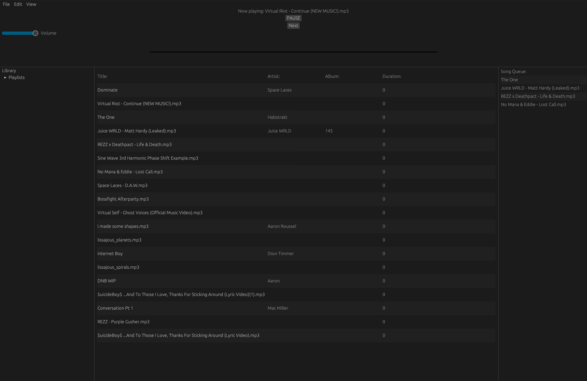
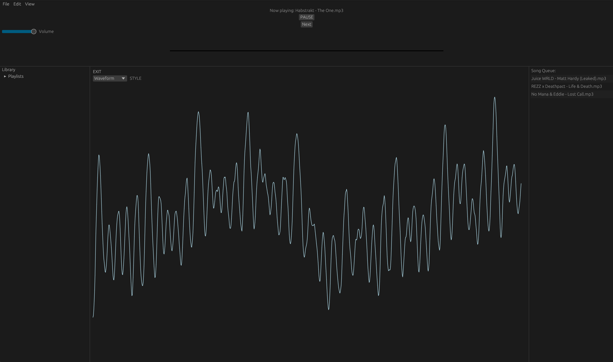

# Rust Music Player App

a rust based music player app with visualization features

## Usage

## Screenshots

## Roadmap

- [x] Add support for tags/META data.
- [x] Find a way to access sample data as it is being played by the audio thread (for visualization)
- [x] Add right click menu for actions on songs
- [x] Add EQ visualization
- [ ] Refactor UI Update function so it's not a complete mess
- [ ] Clean up UI formatting
- [ ] Fix visualization scaling for certain modes
- [ ] Add actual play/pause buttons
- [ ] Allow chaging playback position [either wait for rodio to implement or write a custom audio playback library]
- [ ] Add previous track skip functionality and button
- [ ] Fix app persistence [serde]
- [ ] Add file browser window for adding songs, instead of inserting a file path
